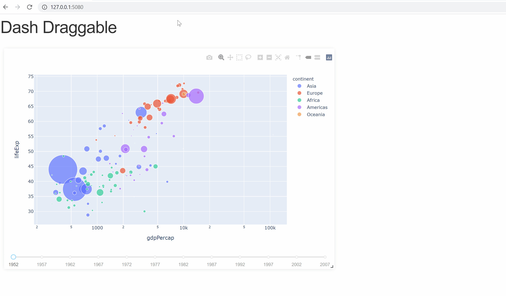

# &#x1F446; Dash Draggable

Dash draggable is a collection of [dash](https://dash.plotly.com/) component for building dashboards with drag and resize functionnalities.

Dash draggable comes with the following components:
- A responsive or fixed layout with draggable and resizable elements:


Under the hodd Dash Draggable is simply an interface to the following proven components:
- [STRML/react-grid-layout](https://github.com/STRML/react-grid-layout)
- ...

# Installation

## Requirements
Dash draggable requires that you installed [dash](https://dash.plotly.com/) and its dependencies.

For more details you can refer to this [link](https://dash.plotly.com/installation).

## Install dash draggable with pip 

```shell
pip install dash_draggable
```

When installed you can check the installation with the following example:

```shell
git clone https://github.com/MehdiChelh/dash_draggable-tmp.git
cd dash_draggable-tmp
python usage.py
```


# Usage

All the source code for the examples bellow can be seen
[here (broken link)](http://brokenlink).

## Draggable Dashboard

1. Write a python file

```python
import dash, dash_draggable
from dash.dependencies import Input, Output, State
import dash_core_components as dcc
import dash_html_components as html
import plotly.express as px
import pandas as pd

app = dash.Dash(__name__)

df = pd.read_csv('https://raw.githubusercontent.com/plotly/datasets/master/gapminderDataFiveYear.csv')

app.layout = html.Div([
    # -- Dash draggable
    dash_draggable.DashDraggable(
        id='draggable',
        children=[
            dcc.Graph(
                id='graph-with-slider',
                responsive=True,
                style=dict(height='100%', width='100%')),
            dcc.Slider(
                id='year-slider',
                min=df['year'].min(),
                max=df['year'].max(),
                value=df['year'].min(),
                marks={str(year): str(year) for year in df['year'].unique()},
                step=None
            )
        ]
    ),
])


# Callback for the graph
@app.callback(
    Output('graph-with-slider', 'figure'),
    Input('year-slider', 'value'))
def update_figure(selected_year):
    filtered_df = df[df.year == selected_year]

    fig = px.scatter(filtered_df, x="gdpPercap", y="lifeExp",
                     size="pop", color="continent", hover_name="country",
                     log_x=True, size_max=55)

    fig.update_layout(transition_duration=500)

    return fig

if __name__ == '__main__':
    app.run_server(debug=True, port='5080')
```

### Drag and Drop (Trello like)


Markdown is a lightweight and easy-to-use syntax for styling your writing. It includes conventions for

```markdown
Syntax highlighted code block

# Header 1
## Header 2
### Header 3

- Bulleted
- List

1. Numbered
2. List

**Bold** and _Italic_ and `Code` text

[Link](url) and 
```

For more details see [GitHub Flavored Markdown](https://guides.github.com/features/mastering-markdown/).

### Jekyll Themes

Your Pages site will use the layout and styles from the Jekyll theme you have selected in your [repository settings](https://github.com/MehdiChelh/dash_draggable-tmp/settings). The name of this theme is saved in the Jekyll `_config.yml` configuration file.

### Support or Contact

Having trouble with Pages? Check out our [documentation](https://docs.github.com/categories/github-pages-basics/) or [contact support](https://github.com/contact) and we’ll help you sort it out.
