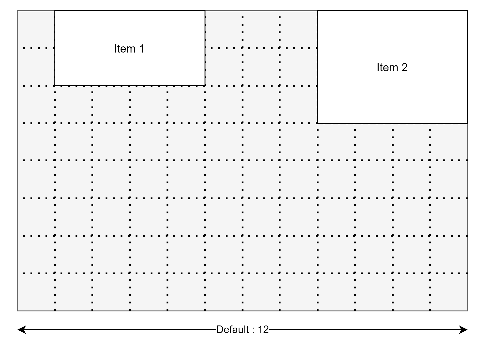
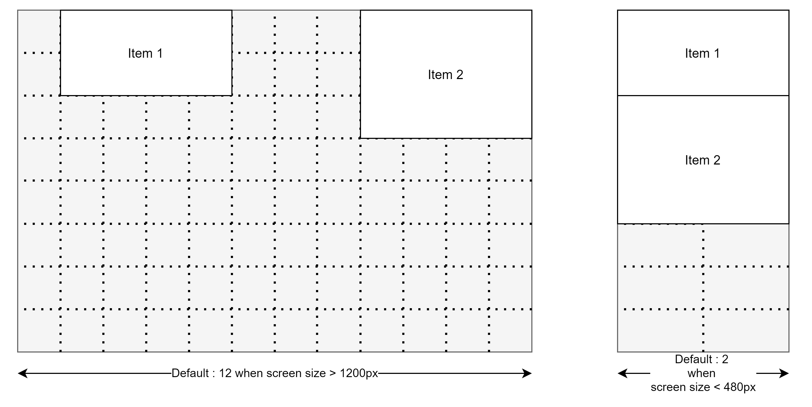

.. dash_draggable documentation master file, created by
   sphinx-quickstart on Wed Dec 30 15:51:58 2020.
   You can adapt this file completely to your liking, but it should at least
   contain the root `toctree` directive.

Dash Draggable
==========================================

.. toctree::
   :maxdepth: 2
   :caption: Contents:

   index
   

.. Indices and tables
.. ==================

.. * `Installation`_
.. * `Quickstart <quickstart.html>`_
.. * `Reference <reference.html>`_
.. * :ref:`search`

Description
--------------------

Dash draggable is a collection of dash_ component for building dashboards with drag and resize functionnalities.

.. _dash: https://dash.plotly.com/

Dash draggable comes with the following components:

- A responsive or fixed layout with draggable and resizable elements:

.. image:: ./assets/img/draggable_dashboard_1.gif

- *(upcoming)* components to drag freely (without grid)
- *(upcoming)* components to drag and drop items in lists (trello-like)

Under the hood Dash Draggable is an interface (with some wrapping) to the following React component:

- `react-grid-layout/react-grid-layout`_

.. _`react-grid-layout/react-grid-layout`: https://github.com/react-grid-layout/react-grid-layout

Installation
--------------------

.. code-block:: bash

      pip install dash-draggable

Note: This library requires dash_.

Your first dashboard (fixed size)
------------------------------------

The following code will give you a simple dashboard with an item containing a chart that you can drag and resize.

You can see a live demo of this example `here <https://dash-draggable.herokuapp.com/>`_.

You can refer to the `Overview`_ section for more details on how to build dashboard using ``dash-draggable``.

You can also browse the `other examples <#examples>`_, for more illustrations.

::

   import dash
   from dash.dependencies import Input, Output
   import dash_core_components as dcc
   import dash_html_components as html

   import plotly.express as px
   import pandas as pd

   import dash_draggable

   external_stylesheets = ['https://codepen.io/chriddyp/pen/bWLwgP.css']

   app = dash.Dash(__name__, external_stylesheets=external_stylesheets)

   server = app.server

   df = pd.read_csv('https://raw.githubusercontent.com/plotly/datasets/master/gapminderDataFiveYear.csv')

   app.layout = html.Div([
      html.H1("Dash Draggable"),
      dash_draggable.GridLayout(
         id='draggable',
         children=[
               html.Div(children=[
                  dcc.Graph(
                     id='graph-with-slider',
                     responsive=True,
                     style={
                           "min-height":"0",
                           "flex-grow":"1"
                     }),
                  dcc.Slider(
                     id='year-slider',
                     min=df['year'].min(),
                     max=df['year'].max(),
                     value=df['year'].min(),
                     marks={str(year): str(year) for year in df['year'].unique()},
                     step=None)
                  ],
                  style={
                     "height":'100%',
                     "width":'100%',
                     "display":"flex",
                     "flex-direction":"column",
                     "flex-grow":"0"
                  }),
         ]
      ),
   ])

   @app.callback(
      Output('graph-with-slider', 'figure'),
      Input('year-slider', 'value'))
   def update_figure(selected_year):
      filtered_df = df[df.year == selected_year]

      fig = px.scatter(filtered_df, x="gdpPercap", y="lifeExp",
                        size="pop", color="continent", hover_name="country",
                        log_x=True, size_max=55)

      fig.update_layout(transition_duration=500)

      return fig

   if __name__ == '__main__':
      app.run_server(debug=True, port='5080')

Overview
==========================================

Currently dash-draggable allows you to use either a **fixed size** or a **responsive** layouts.

Fixed size layouts
------------------------

The minimal code for using a fixed grid layout is the following:

.. code-block:: python
   
   app.layout = html.Div([
      dash_draggable.GridLayout([
         # my items
      ])
   ])

By default the items are put on a 12 columns grid layout with a width of 1200px. Those parameters can be changed using the arguments ``gridCols`` and ``width``.

The default size and position of the items can be set using the ``layout`` argument. (see the `example <https://github.com/MehdiChelh/dash-draggable/blob/master/examples/layout/layout-argument.py>`_ and also `react-grid-layout#grid-layout-props <https://github.com/react-grid-layout/react-grid-layout#grid-layout-props>`__)

For more information on ``dash_draggable.GridLayout`` see : `Fixed size layout - GridLayout`_

.. _`react-grid-layout#grid-layout-props`: https://github.com/react-grid-layout/react-grid-layout#grid-layout-props

Responsive layouts
------------------------

The minimal code for using a responsive layout is the following:

.. code-block:: python
   
   app.layout = html.Div([
      dash_draggable.ResponsiveGridLayout([
         # my items
      ])
   ])

   
The responsive layout is characterized by breakpoints that change the format of the grid according to the screen size.

By default, the breakpoints are defined as follow: ``{lg: 1200, md: 996, sm: 768, xs: 480, xxs: 0}`` (value in pixel).

The default number of columns of the grid is defined as follow : ``{lg: 12, md: 10, sm: 6, xs: 4, xxs: 2}``. But this parameter can be changed using the argument ``gridCols``.

The default size and position of the items can be set using the ``layouts`` argument. (see the `example <https://github.com/MehdiChelh/dash-draggable/blob/master/examples/layout/layout-argument-responsive.py>`_ and also `react-grid-layout#responsive-grid-layout-props`_)

For more information on ``dash_draggable.ResponsiveGridLayout`` see : `Responsive layout - ResponsiveGridLayout`_

.. _`react-grid-layout#responsive-grid-layout-props`: https://github.com/react-grid-layout/react-grid-layout#responsive-grid-layout-props

Examples
---------------------------

You can see other examples in the github repository of the project:

- With a fixed size layout:
   - Basic example: `examples/simple_example/simple_example.py <https://github.com/MehdiChelh/dash-draggable/blob/master/examples/simple_example/simple_example.py>`_
   - Example using the *layout* argument: `examples/layout/layout-argument.py <https://github.com/MehdiChelh/dash-draggable/blob/master/examples/layout/layout-argument.py>`_
- With a responsive layout:
   - Basic example : `examples/simple_example/simple_example-responsive.py <https://github.com/MehdiChelh/dash-draggable/blob/master/examples/simple_example/simple_example-responsive.py>`_
   - Example using the *layout* argument: `examples/layout/layout-argument-responsive.py <https://github.com/MehdiChelh/dash-draggable/blob/master/examples/layout/layout-argument-responsive.py>`_

   

Reference
==============

Fixed size layout - GridLayout
-----------------------

.. glossary::
   
   dash_draggable.GridLayout
      - Description:
         GridLayout is a component for building dashboards with draggable and resizable items.

         By default, GridLayout will saved the position of each element on the client side. 
         But you can also save it on server side by defining a callback with : ``Input(“<my-id>”, “layout”)``.
      - Arguments:
         - **children** *[list]*: 
            a list of dash components
         - **id** *[optional, str]*
            id of the component
         - **layouts** *[optional, dict]*
            A list where each value gives the position (x, y) and the size (h, w) 
            of the components added to **children** : ``[{"x": number, "y": number, "w": number, "h": number}]`` 
            
            see `here <https://github.com/MehdiChelh/dash-draggable/blob/master/examples/layout/layout-argument.py>`_ for an example

            see `react-grid-layout#grid-layout-props`_ 
            
         - **save** *[optional, default=True]*
            save the position of elements on client side, if True.
         - **clearSavedLayout** *[optional, default=False]*
            allows you to clear the saved position and size of elements, when the page loads.
         - **ncols** *[optional, default=6]*
            default width of components added to **children** ; measured in number of columns (the default number of columns of the grid is 12, see ``gridCols``).
         - **nrows** *[optional, default=8]*
            default width of components added to **children** ; measured as a multiple of ``height`` (default valut is 30px).
         - **gridCols** *[optional, default=12]*
            number of columns for the grid.
         - **width** *[optional, default=1200]*
            width of the grid (in pixels).
         - **height** *[optional, default=30]*
            height of the rows of the grid (in pixels).
         - **className** *[optional, str]*
            additional classes passed to `react-grid-layout#grid-layout-props`_
         - **style** *[optional, dict]*
            additional styling passed to `react-grid-layout#grid-layout-props`_

Responsive layout - ResponsiveGridLayout
---------------------------------------------

.. glossary::
   
   dash_draggable.ResponsiveGridLayout
      - Description:
         ResponsiveGridLayout is a component for building dashboards with draggable and resizable items.

         By default, ResponsiveGridLayout will saved the position of each element on the client side. 
         But you can also save it on server side by defining a callback with : ``Input(“<my-id>”, “layouts”)`` (``Input(“<my-id>”, “current_layout”)`` for the layout specific to the current screen size).
      - Arguments:
         - **children** *[list]*: 
            a list of dash components
         - **id** *[optional, str]*
            id of the component
         - **layout** *[optional, dict]*
            A dictionnary where each key is a breakpoint and each value is a list of dictionnary (similar to ``layout`` for **dash_draggable.GridLayout**) giving the position (x, y) and the size (h, w)
            of the **children** : ``{lg: [{"x": number, "y": number, "w": number, "h": number}], ...}``
            
            see `here <https://github.com/MehdiChelh/dash-draggable/blob/master/examples/layout/layout-argument-responsive.py>`_ for an example

            see also `react-grid-layout#responsive-grid-layout-props`_ 
            
         - **save** *[optional, default=True]*
            save the position of elements on client side, if True.
         - **clearSavedLayout** *[optional, default=False]*
            allows you to clear the saved position and size of elements, when the page loads.
         - **breakpoints** *[optional, default={lg: 1200, md: 996, sm: 768, xs: 480, xxs: 0}}]*
            breakpoints defined by the screen size (value in pixels). 
         - **ncols** *[optional, default={lg: 6, md: 5, sm: 3, xs: 4, xxs: 2}]*
            default width of components added to **children** ; measured in number of columns (depending on the screen size).
         - **nrows** *[optional, default=8]*
            default width of components added to **children** ; measured as a multiple of ``height`` (default valut is 30px).
         - **gridCols** *[optional, default={lg: 12, md: 10, sm: 6, xs: 4, xxs: 2}]*
            number of columns for the grid (depending on the screen size).
         - **height** *[optional, default=30]*
            height of the rows of the grid (in pixels).
         - **className** *[optional, str]*
            additional classes passed to `react-grid-layout#grid-layout-props`_
         - **style** *[optional, dict]*
            additional styling passed to `react-grid-layout#grid-layout-props`_

.. Keyword arguments: - children  - id (string; optional): (string) The ID used to identify this component in Dash callbacks. The id is also used to automatically save the layout on client side. - layout (list of dicts; optional): Layout is a list of dictionnary with the format: {x: number, y: number, w: number, h: number} The index into the layout must match the id used on each item component with DashboardItem. If you choose to use custom keys, you can specify that key in the layout array objects like so: {i: string, x: number, y: number, w: number, h: number} The ID used to identify this component in Dash callbacks. The id is also used to automatically save the layout on client side. - save (boolean; default True): (bool) If False, then the layout is not saved in the browser. Default value is True. - clearSavedLayout (boolean; default False): (bool) If set to true, then the layout saved in the client browser will be cleared on page load. - ncols (number; optional): (number) the default number of columns by item. Default value is 6. - nrows (number; optional): (number) the default number of row by item. Default value is 8. - width (number; optional): (number) width (in px). Default value is 1200. - height (number; optional): (number) height of a row (in px). Default value is 30. - className (string; default “”): (string) class passed to the react-grid-layout component - style (dict; optional): (dict) css style passed to the react-grid-layout component

.. .. code-block:: python

..    dash_draggable.GridLayout(children=[])

.. .. autoclass:: dash_draggable.GridLayout

